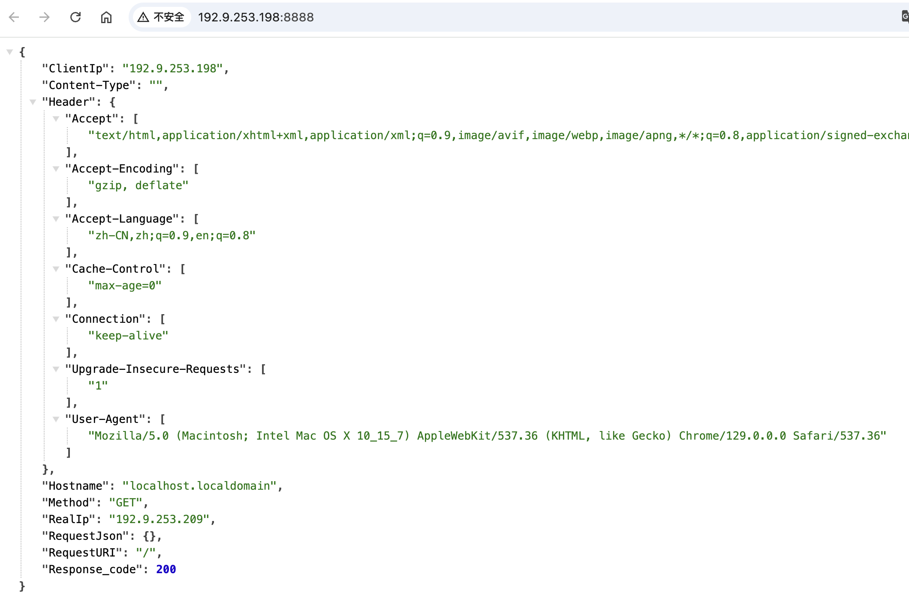

vhagar
======

### wsctl 运维管理工具

特性
------

* 网络测试
* 定时任务
* 中间件巡检
* metrics 监控指标

安装
------
#### 二进制文件

下载最新版本的[二进制文件](https://private-1253767630.cos.ap-shanghai.myqcloud.com/tools/archive/binary_tag/bin/wsctl)和[配置模版](https://private-1253767630.cos.ap-shanghai.myqcloud.com/tools/archive/binary_tag/bin/config.toml)

```bash
# 修改配置文件
vim config.toml
# 授权
chmod +x wsctl
# 启动
./wsctl
```

#### Docker 启动

调整配置文件 config.toml，挂载到容器内部

```yaml
version: "3.8"
services:
  vhagar:
    image: ka-tcr.tencentcloudcr.com/middleware/vhagar:v1.0
    container_name: vhagar
    ports:
      - "8089:8089"
    volumes:
      - ./config.toml:/app/config.toml
    restart: unless-stopped
```
**启动：`docker-compose up -d`**

快速上手
------

### 网络测试

默认端口 8099，可通过 -p 参数指定端口
```bash
[root@localhost vhagar]# ./wsctl -p 8888
2024/10/12 18:30:35 读取配置文件 /opt/vhagar/config.toml
2024/10/12 18:30:35 wsctl go go go！！！
2024/10/12 18:30:35 Starting server at http://192.9.253.198:8888/
```




### 查看帮助

```bash
[root@localhost vhagar]# ./wsctl -h
A longer description that vhagar

Usage:
  wsctl [flags]
  wsctl [command]

Available Commands:
  completion  Generate the autocompletion script for the specified shell
  cron        启动定时任务
  help        Help about any command
  metric      监控指标
  task        检查服务
  version     查看版本

Flags:
  -c, --config string   config file (default "config.toml")
  -h, --help            help for wsctl
  -p, --port string     web 端口 (default "8099")

Use "wsctl [command] --help" for more information about a command.
```

### 定时任务

```bash
# 调度模式，定时任务
[root@localhost vhagar]# ./wsctl crontab
2024/08/19 18:08:40 Info: 读取配置文件 config.toml
2024/08/19 18:08:40 启动任务调度
# 后台运行
nohup ./wsctl crontab > /dev/null 2>&1 &
```
